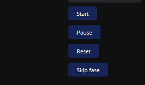
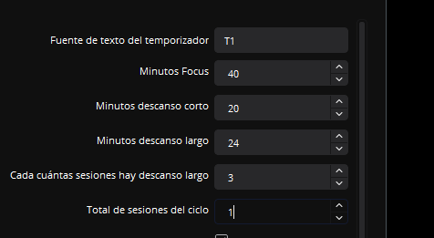
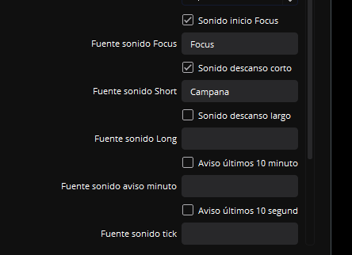

# Pomodoro Timer para OBS Studio

**Un temporizador Pomodoro para OBS que muestra el tiempo en pantalla, reproduce sonidos y te ayuda a mantener foco mientras transmites o grabas.**

---

## 📸 Capturas (cómo se ve en OBS)

> Estos ejemplos vienen de la propia ventana de scripts de OBS: controles, ajustes y vista en escena.

*Botones para iniciar/pausar/resetear y opciones de temporizador*.

*Configura los minutos de Focus, descanso corto/largo y cuántas sesiones forman un ciclo.*

*Activa sonidos para cada fase y el aviso de últimos minutos/segundos.*

---

## 🚀 Inicio rápido

1. Descarga el script `pomodoro_lechudev.lua` y colócalo en una carpeta accesible (idealmente la de scripts de OBS).
2. En OBS, ve a **Herramientas > Scripts** y agrega el archivo.
3. Crea una fuente de texto en tu escena (Texto GDI+ o similar) y selecciónala en el script.
4. Ajusta los minutos de foco y descansos según tu ritmo.
5. ¡Pulsa **Start** y empieza a trabajar con Pomodoro!

---

## ✅ ¿Qué hace este script?

- Muestra en tu escena el estado actual: **FOCUS / SHORT BREAK / LONG BREAK**.
- Cambia automáticamente entre trabajo y descanso.
- Reproduce sonidos al inicio de cada fase y en avisos (últimos 10 minutos/10 segundos).
- Te permite pausar, resetear o saltar fases con un solo clic.

---

## 🛠️ Uso rápido (sin complicaciones)

### 1) Configurar la fuente de texto

1. Agrega una fuente de texto en OBS (Texto GDI+ o similar).
2. Nómbrala (por ejemplo, **Pomodoro Timer**).
3. En el script, selecciona esa fuente en el campo **Fuente de texto del temporizador**.

### 2) Ajustes principales

- **Minutos Focus**: duración de cada sesión de trabajo.
- **Minutos descanso corto**: duración del descanso corto.
- **Minutos descanso largo**: duración del descanso largo.
- **Cada cuántas sesiones hay descanso largo**: cuántos bloques de trabajo hasta un descanso largo.
- **Total de sesiones del ciclo**: cuántas sesiones completan un ciclo completo.

### 3) Sonidos (opcional)

- Crea fuentes de medios en OBS con tus archivos de audio.
- Selecciona esas fuentes en el script (Focus, Short, Long, aviso, tick).
- Activa las casillas para habilitar cada sonido.

### 💡 Consejos rápidos

- Ajusta la fuente/estilo del texto en OBS para que se vea claro en tu escena.
- Si transmites, usa una escena aparte para el “modo focus” y otra para el “modo descanso”.
- ¿Tienes prisa? El botón **Reset** vuelve al inicio de la sesión.

---

## 🧠 ¿Cómo funciona?

- El temporizador se actualiza automáticamente y envía el estado a una fuente de texto en tu escena.
- Cuando termina una fase, cambia al siguiente tipo (Focus → Short → Focus → … → Long).
- Cada ciclo combina varios bloques de trabajo y descansos.
- El script emite avisos en los últimos 10 minutos de Focus y en los últimos 10 segundos de cualquier fase.

---

## 🔧 Instalación (detalles técnicos)

### Requisitos previos

- **OBS Studio** (válido para Windows, macOS o Linux).
- **Lua**: ya incluido con OBS, no requiere instalación.

### Pasos de instalación

1. Clona este repositorio o descarga `pomodoro_lechudev.lua`.
2. En OBS, ve a **Herramientas > Scripts**.
3. Agrega `pomodoro_lechudev.lua`.
4. Configura el script como se describe arriba.

---

## 🤝 Contribución

¿Tienes una idea o encontraste un bug? Abre un issue o un pull request en este repositorio.

---

## 📄 Licencia

Este proyecto está bajo la Licencia MIT.

---

## ✨ Autor

Creado por lechudev. ¡Gracias por usar Pomodoro Timer para OBS!
